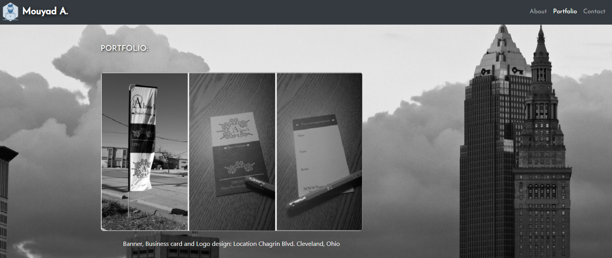
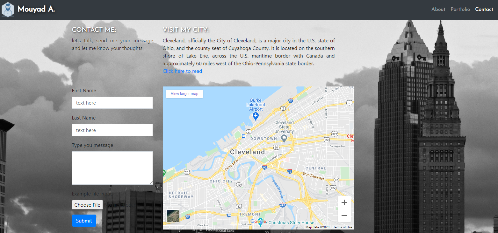

## Hello world!

* This project was designed for a homework assignment for CWRU - Full-Stack bootcamp.
* This project has been deployed to GitHub Pages. To get this project up and running, you can follow the deployment link. Or, download the sources files to use this as a template.

* I created simple "Online Bio" site! this is the first step on an ongoing project. 
* I have a passion for learning new HTML and SCC skills. 
As you navigate throught the site, 

## "About": is where my site land, I included my image and brief about me and my achievements. see below snapshot:

## Portfolio : In this page you will find images and samples from previous projects, I included hyperlinks for more information. see below snapshot:

## Contact : In this page you will find a "Contact me" form where you can email me your thoughts. Map for Cleveland (my City), Images from Cleveland, Instant Chat form and a Flight ticket search engin. see below snapshot:

Hint: I ope you like the logo that I created, upper left corner! 

This application is responsive

please feel free to send a tip, give me a shout out or add me on: https://www.linkedin.com/in/mouyad/